# Vendee Globe Business Case

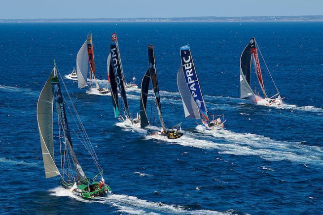

## Welcome to Vendee Globe Business Case

The Vendée Globe is a solo non-stop round the world yacht
race founded by Philippe Jeantot in 1989. The race takes place
every four years and is considered an extreme quest of
individual endurance and the ultimate test in ocean racing.
The 9th edition of the Vendee Globe was held in 2020-2021
and was won by French sailor Yannick Bestaven who took
slightly over 80 days to sail non-stop around the globe.
During the race, spectators could follow the action live on an
online racing dashboard. The technology for tracking the boats
live was provided by Nokia.

## Your challenge

In this business case, you will assume the role of Nokia. You will build a cloud-based [Lambda Architecture](https://en.wikipedia.org/wiki/Lambda_architecture) to process the telemetry data from the sailing boats. Your architecture should run in Azure and contain a real-time path for processing sailing boat data in real time, and a batch-processing path for collecting sailing boat data in batches and performing calculations on those batches. 

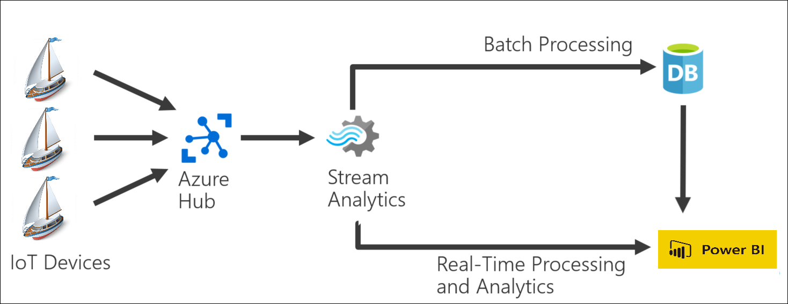

The Lambda Architecture should send all boat data to a PowerBI dashboard. The dashboard should display a world map with the current position of each boat, and a table with a ranking of racing teams. The ranking table should be sorted by who is currently in the lead. 

Since there was no Vendee Globe race when I created this project, I used an app that imitates the real-time data from the participants of the Vendee Globe Race.It is a simple app that was not created by me. It can be found here: https://github.com/mdfarragher/TCS/blob/main/race_simulator.py

To complete this business case, we need to do the following:

1. Create a Lambda Architecture in Azure with a real-time path and a batch-processing path. Our architecture should include an Event Hub, a Stream Analytics Job, and an output to PowerBI. The batch-processing path can use any data storage service you prefer: a Data Lake, a SQL Database, a Cosmos database, or a Synapse Analytics Workspace.
2. Create a PowerBI dashboard that displays a world map with the current location of each racing team, and a table with the teams ranked by position in the race.
3. Download the Python race simulation app to your local computer. Configure the app to send data to your EventHub.
4. Start the Python app. Every 60 seconds, the telemetry of the simulated racing boats will be sent to your Azure cloud.

You will have completed the business case if your PowerBI dashboard correctly shows the position and ranking of each sailing team in the race.

## Getting started

To help us get started, guided instructions were given to build the first piece of the Lambda Architecture which consisted of an Event Hub and instructions to get the Python sailing simulator up and running. 

To complete the business case, here's what we needed to add:

* The remaining pieces of the Lambda Architecture: a Stream Analytics Job, an output to PowerBI, and a second output to a data storage service of our choice.
* A data storage service of our choice to store batch data: a Data Lake, a SQL Database, a Cosmos database, or a Synapse Analytics Workspace.
* A view or stored procedure or Synapse notebook to calculate the table of teams ranked by position in the race.
* A PowerBI dashboard that displays a world map with the current location of each racing team, and a table with the teams ranked by position in the race.

We will have completed the business case when our PowerBI dashboard correctly shows the position and ranking of each sailing team in the race. 

## Challenges

During the business case, we will need to address several challenges:

* The Python app occasionally produces garbled data. We need to ensure that only clean data arrives in the PowerBI dashboard? 
* How are we going to calculate the ranked list of sailing teams? How will we calculate who is ahead in the race?
* Which data service are we going to use for the batch-processing path in the Lambda Architecture?
* How will we present our data in the PowerBI dashboard?

There are multiple solutions for each challenge but we will describe here the decisions we made to address each of these challenges and present our final solution

# Vendee Globe Intro

 
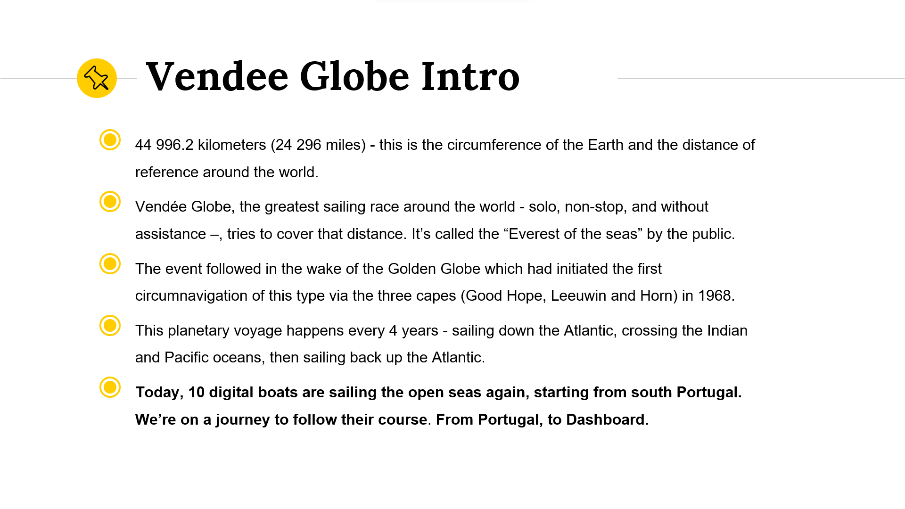

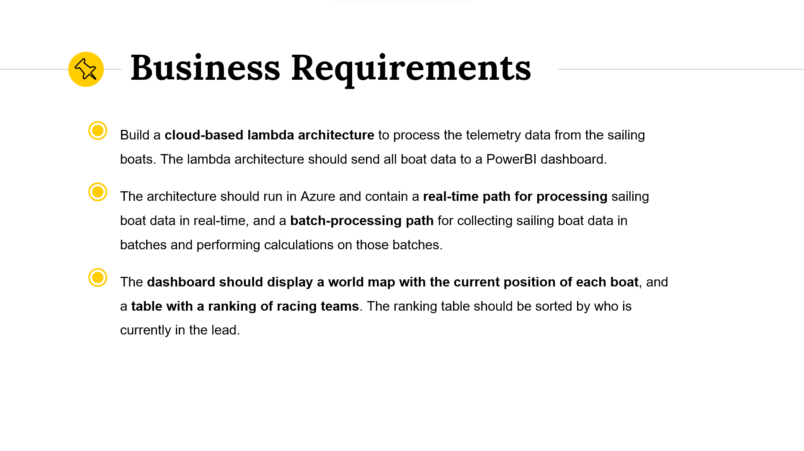
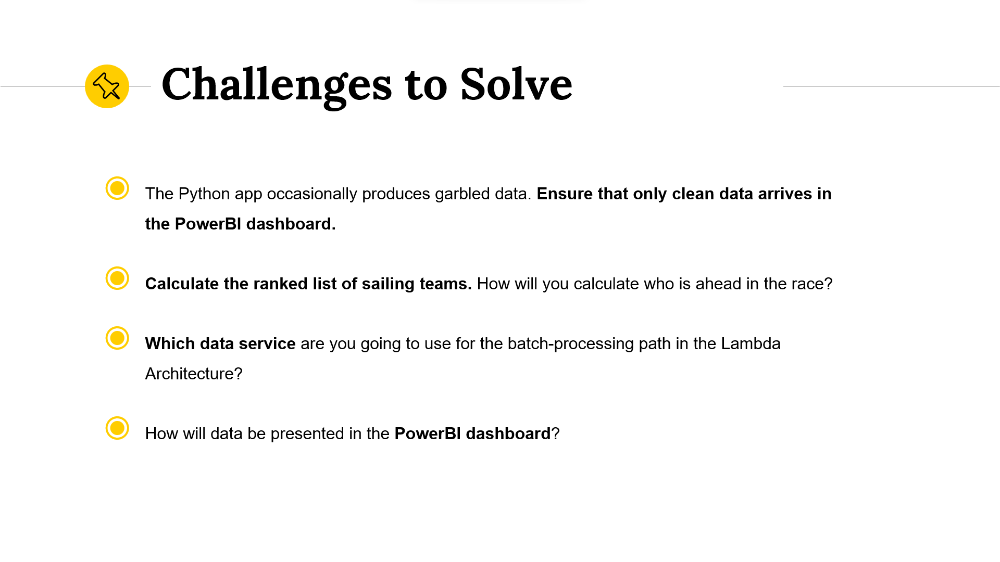
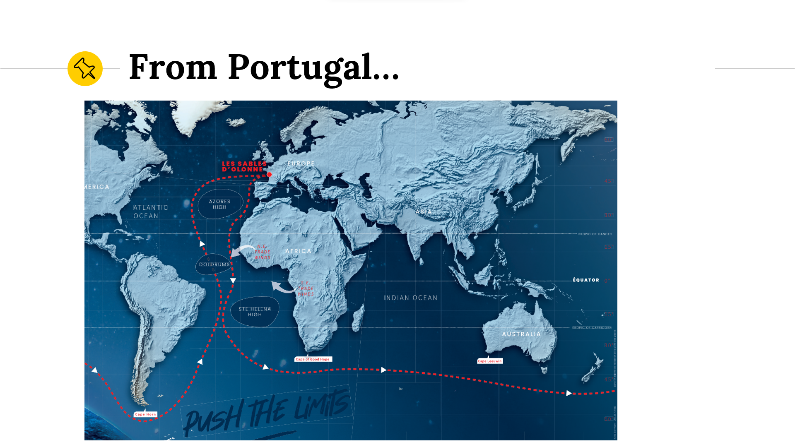

The boats leave from South of Portugal. They head south-east around the globe, sending data about their location every 60 seconds. 

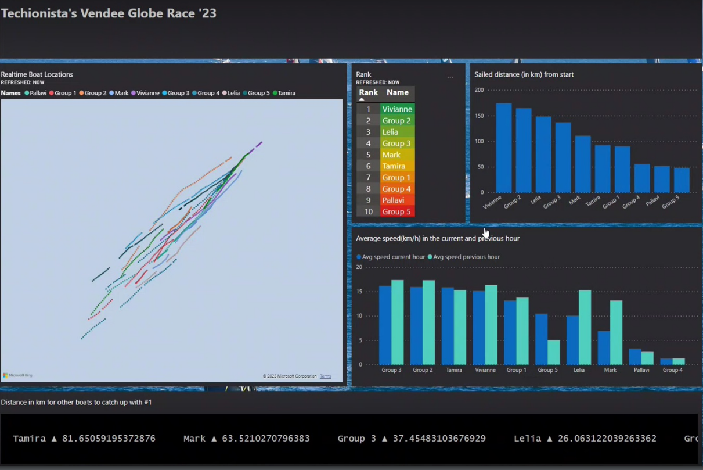

We started off looking at various options and decided on the following architecture

* An Event Hub for collecting sailing boat data. Phyton simulator was used to stream data to event hub
* A Stream Analytics Job for processing the data in real time (hot tier) and in batches (cool tier)
* Data Lake Gen2 for low cost storage
* Synapse serverless pools for collecting data batches and preforming batch calculations for ranking and for fun we added in other calculations for speed.
* A Power BI dashboard for displaying both real time and batch data

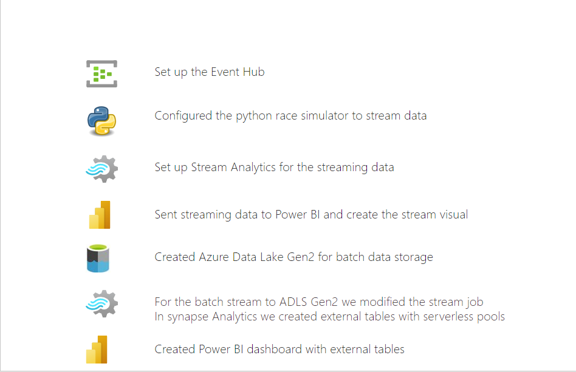

We have connected python simulator with eventhub endpoint and name. It stars running.

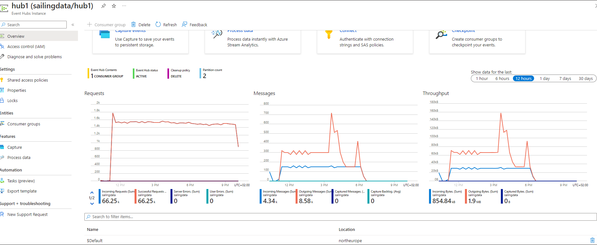

On the eventhubs overview page we can verify that the streaming data is been received and is been outputted 

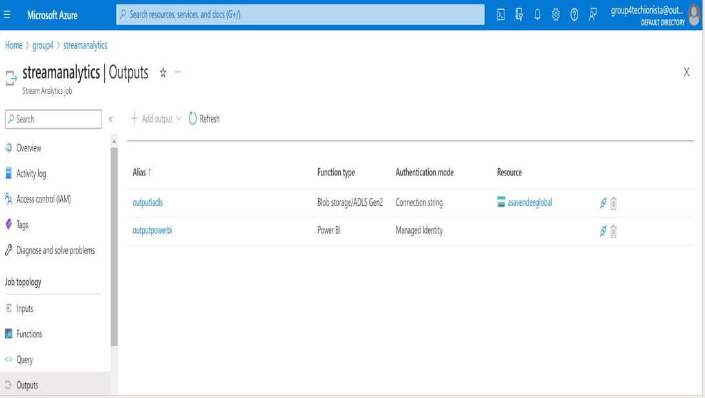
In Azure Stream Analytics we created a streaming job with two outputs

* outputladls is saving the data in the cool tier ADLS Gen2
* outputpowerbi is our real time stream to Power BI service.In Power BI we used RouteMap visualisation to display the real time location and route taken for each boat

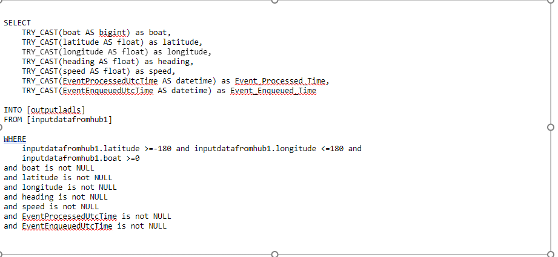
For both the batch data and the streaming data we had to make queries. However as mentioned in the case, the Python app occasionally produces garbled data. In order to ensure that only clean data would arrive in the PowerBI dashboard and in the ADLS Gen2, both queries exclude any rows with invalid longitude or latitude values. For the ADLS Gen2 we CAST the values because some were being stored as integers, which did not work when we imported the data into Power BI. With TRY_CAST SQL returns the expression in the desired data type if the CAST function succeeds.  

Each output required a query and it is here that we handled the invalid data that was been streamed. As you can see from this screen both queries exclude any rows with invalid longitute or latitude values.

For the batch stream to ADLS Gen2 we also had to CAST the values as some values where been stored as Integers and were causing issues when we imported the data to Power Bi desktop. TRY_CAST function , which is similar to the CAST Function, is used to convert an expression from one data type to another. If it succeeds, then SQL TRY CAST will return the expression in the desired data type. Otherwise, it will return null. Its for this reason we then only select rows that are not null

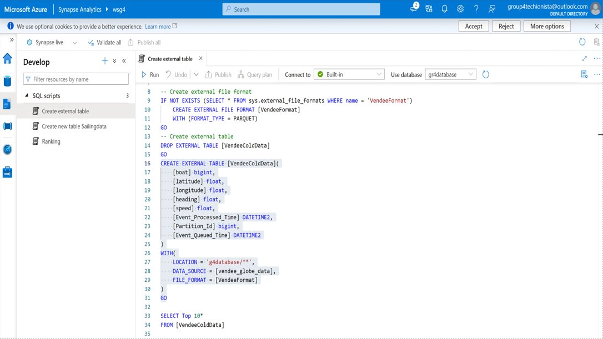
In Synapse we created an external table using serverless pools. Serverless pools where used as they are low cost solution and allowed us to integrate easily to Power Bi Desktop
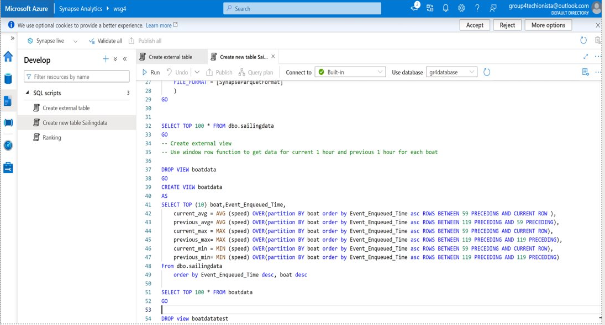
Using this external table we then created a view to get speed statistics for each boat. A window row function was used to get the stats for each boat for last 24 hours and previous 24 hours. The query used assumes one message received per minute for each boat. 

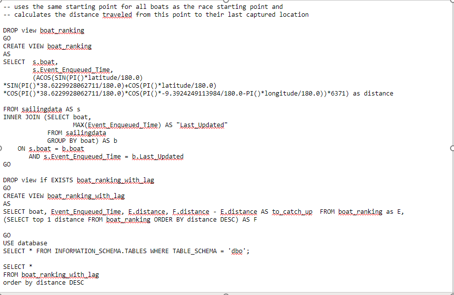
As in the business case, the race started from portugal so we have taken portugal lattitide and longitude as starting points and caluclated the distance travelled from the starting place by boat and then caluclated rankings.

Then we created reports using PowerBI. In powerBI, we have created a measure to change the speed in knots to km.
# Completed Dashboard

)
